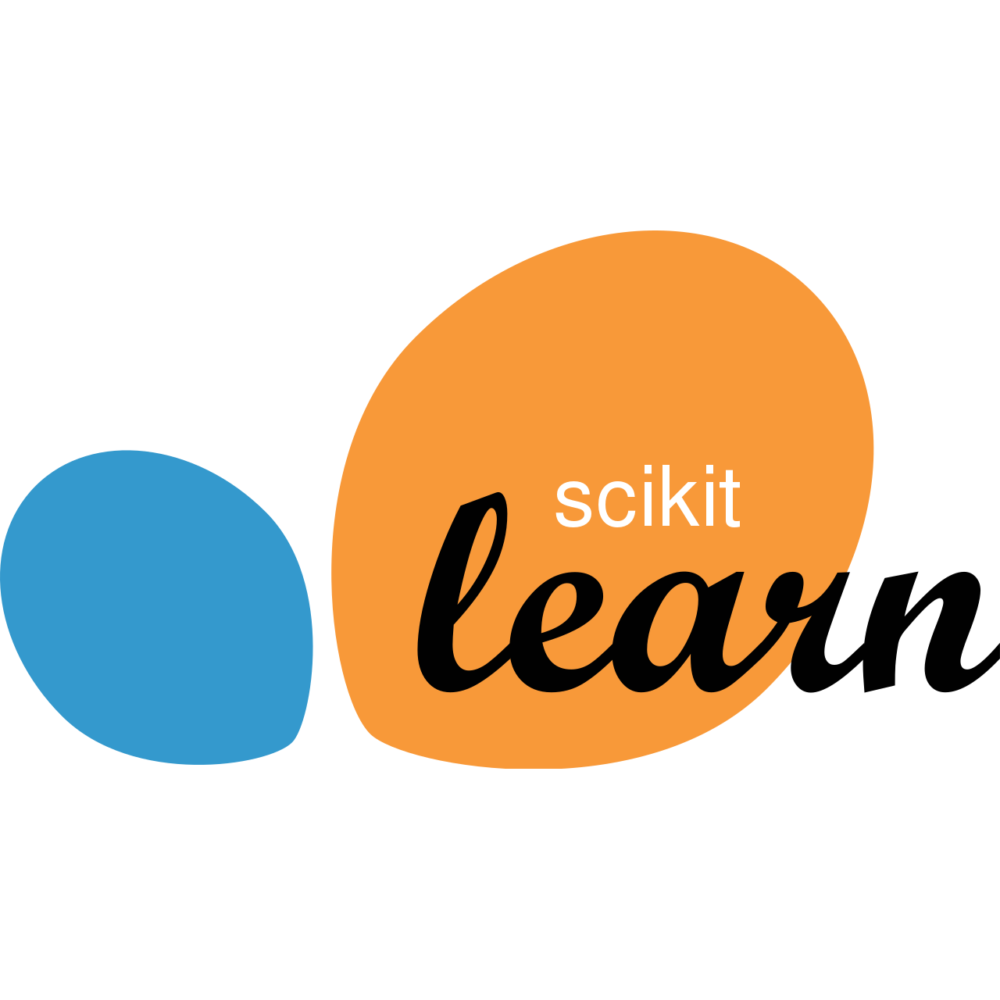

    

<h2 align="left" id="datablets">🛠️ Toolbelt</h2>

<table>
  <tr>
<!--     <td align="center" width="96">
      
       C#&nbsp;(Core)
    </td> -->
    <td align="center" width="96">
      
       Python
    </td>
<!--     <td align="center" width="96">
      
       Go
    </td> -->
    <td align="center" width="96">
      
       Jupyter Notebook
    </td>
<!--     <td align="center" width="96">
      
       Rust
    </td> -->
    <td align="center" width="96">
      
       Rust
    </td>
    <td align="center"  width="96">
      
       Apache Spark
    </td>
        <td align="center"  width="96">
      
       Apache Kafka
    </td>
<!--     <td align="center" width="96">
      
       React
    </td> -->
<!--     <td align="center" width="96">
      
       Bootstrap
    </td> -->
<!--     <td align="center" width="96">
      
       Sass
    </td> -->
  </tr>
  <tr>
    <td align="center" width="96"> 
      
       Docker
    </td>
<!--     <td align="center" width="96">
      
       Kubernetes
    </td> -->
    <td align="center" width="96">
      
       Z Shell
    </td>
    <td align="center"  width="96">
      
       PostgreSQL
    </td>
    <td align="center" width="96">
      
       Scikit-learn
    </td>
<!--     <td align="center" width="96">
      
       TensorFlow
    </td> -->
    <td align="center" width="96">
      
       AWS
    </td>
  </tr>
</table>
